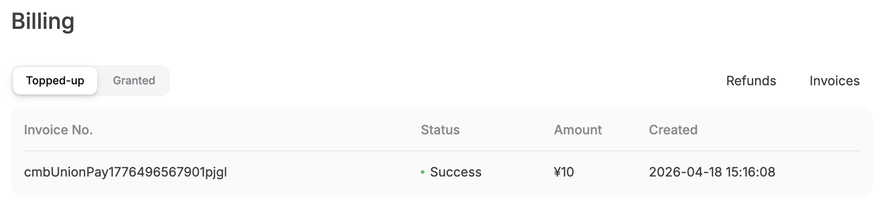

# CRE 项目搭建

我们用 CLI 从零创建你的第一个 CRE 项目。

## 步骤 1：初始化项目

打开终端并运行：

```bash
cre init
```

你会看到 CRE 初始化向导：

```bash
🔗 Welcome to CRE!

✔ Project name? [my-project]:
```

**输入：** `prediction-market` 然后按回车。

```bash
? What language do you want to use?: 
  ▸ Golang
    Typescript
```

**选择：**用方向键选中 `Typescript` 后按回车。

```bash
✔ Typescript
Use the arrow keys to navigate: ↓ ↑ → ← 
? Pick a workflow template: 
  ▸ Helloworld: Typescript Hello World example
    Custom data feed: Typescript updating on-chain data periodically using offchain API data
    Confidential Http: Typescript example using the confidential http capability
```

**选择：** `Helloworld` 后按回车。

```bash
✔ Workflow name? [my-workflow]:
```

**直接按回车**接受默认的 `my-workflow`。

```bash
🎉 Project created successfully!

Next steps:
  cd prediction-market
  bun install --cwd ./my-workflow
  cre workflow simulate my-workflow
```

## 步骤 2：进入目录并安装依赖

按 CLI 给出的说明操作：

```bash
cd prediction-market
bun install --cwd ./my-workflow
```

你会看到 Bun 正在安装 CRE SDK 与依赖：

```bash
$ bunx cre-setup

✅ CRE TS SDK is ready to use.

+ @types/bun@1.2.21
+ @chainlink/cre-sdk@1.0.1

30 packages installed [5.50s]
```

## 步骤 2.5：配置环境变量

`cre init` 会在项目根目录生成 `.env` 文件。该文件会同时被 CRE workflow 与 Foundry（智能合约部署）使用。我们来配置它：

```bash
###############################################################################
### REQUIRED ENVIRONMENT VARIABLES - SENSITIVE INFORMATION                  ###
### DO NOT STORE RAW SECRETS HERE IN PLAINTEXT IF AVOIDABLE                 ###
### DO NOT UPLOAD OR SHARE THIS FILE UNDER ANY CIRCUMSTANCES                ###
###############################################################################

# Ethereum private key or 1Password reference (e.g. op://vault/item/field)
CRE_ETH_PRIVATE_KEY=YOUR_PRIVATE_KEY_HERE

# Default target used when --target flag is not specified (e.g. staging-settings, production-settings, my-target)
CRE_TARGET=staging-settings

# Deepseek configuration: API Key
DEEPSEEK_API_KEY_VAR=YOUR_DEEPSEEK_API_KEY_HERE
```

> ⚠️ **安全提示**：切勿提交 `.env` 或分享私钥！`.gitignore` 已默认排除 `.env` 文件。


将占位符替换为实际值：
- `YOUR_PRIVATE_KEY_HERE`：你的 Ethereum 私钥（带 `0x` 前缀）
- `YOUR_DEEPSEEK_API_KEY_HERE`：你的 Deepseek API 密钥（在 [Deepseek AI Studio](https://platform.deepseek.com/api_keys) 获取）

**关于 Deepseek API 密钥**

请在 [Deepseek 控制台](https://platform.deepseek.com/api_keys) 为 Deepseek API 密钥开通计费，以免后续出现 `402 - {"error":{"message":"Insufficient Balance","type":"unknown_error","param":null,"code":"invalid_request_error"}}`。海外用户需要绑定信用卡以启用计费，国内用户直接使用支付宝/微信支付最小额度，本次演示预计只会消耗 0.01 人民币。



## 步骤 3：浏览项目结构

看看 `cre init` 为我们生成了什么：

```bash
prediction-market/
├── project.yaml            # Project-wide settings (RPCs, chains)
├── secrets.yaml            # Secret variable mappings
├── .env                    # Environment variables
└── my-workflow/            # Your workflow directory
    ├── workflow.yaml       # Workflow-specific settings
    ├── main.ts             # Workflow entry point ⭐
    ├── config.staging.json # Configuration for simulation
    ├── package.json        # Node.js dependencies
    └── tsconfig.json       # TypeScript configuration
```

### 关键文件说明

| 文件 | 用途 |
|------|---------|
| `project.yaml` | 访问区块链用的 RPC 端点 |
| `secrets.yaml` | 将环境变量映射到密钥 |
| `.env` | CRE 与 Foundry 的环境变量 |
| `workflow.yaml` | Workflow 名称与文件路径 |
| `main.ts` | 你的 workflow 代码在这里 |
| `config.staging.json` | 模拟运行用的配置值 |

## 步骤 4：运行第一次模拟

激动人心的部分来了——我们来模拟 workflow：

```bash
cre workflow simulate my-workflow
```

你会看到模拟器初始化：

```bash
[SIMULATION] Simulator Initialized

[SIMULATION] Running trigger trigger=cron-trigger@1.0.0
[USER LOG] Hello world! Workflow triggered.

Workflow Simulation Result:
 "Hello world!"

[SIMULATION] Execution finished signal received
```

🎉 **恭喜！**你已经跑通了第一个 CRE workflow！

## 步骤 5：理解 Hello World 代码

看看 `my-workflow/main.ts` 里有什么：

```typescript
// my-workflow/main.ts

import { cre, Runner, type Runtime } from "@chainlink/cre-sdk";

type Config = {
  schedule: string;
};

const onCronTrigger = (runtime: Runtime<Config>): string => {
  runtime.log("Hello world! Workflow triggered.");
  return "Hello world!";
};

const initWorkflow = (config: Config) => {
  const cron = new cre.capabilities.CronCapability();

  return [
    cre.handler(
      cron.trigger(
        { schedule: config.schedule }
      ), 
      onCronTrigger
    ),
  ];
};

export async function main() {
  const runner = await Runner.newRunner<Config>();
  await runner.run(initWorkflow);
}

main();
```

### 模式：Trigger → Callback

每个 CRE workflow 都遵循这一模式：

```ts
cre.handler(trigger, callback)
```

- **Trigger**：启动 workflow 的条件（CRON、HTTP、Log）
- **Callback**：trigger 触发时执行的逻辑

> **说明**：Hello World 使用 CRON Trigger（基于时间）。在本训练营中，我们会为预测市场使用**HTTP Trigger**（Day 2）和**Log Trigger**（Day 3）。

## 常用命令速查

| 命令 | 作用 |
|---------|--------------|
| `cre init` | 创建新的 CRE 项目 |
| `cre workflow simulate <name>` | 在本地模拟 workflow |
| `cre workflow simulate <name> --broadcast` | 模拟并执行真实链上写入 |

## 🎉 第 1 天课程完成！

你已经成功：

- ✅ 了解 CRE 功能和基础架构
- ✅ 新建 CRE 项目
- ✅ 进行了 CRE workflow 的模拟

明天我们将添加：

- HTTP Trigger（响应 HTTP 请求）
- 部署预测市场的智能合约
- EVM Write（将数据写入区块链）

**明天见！**