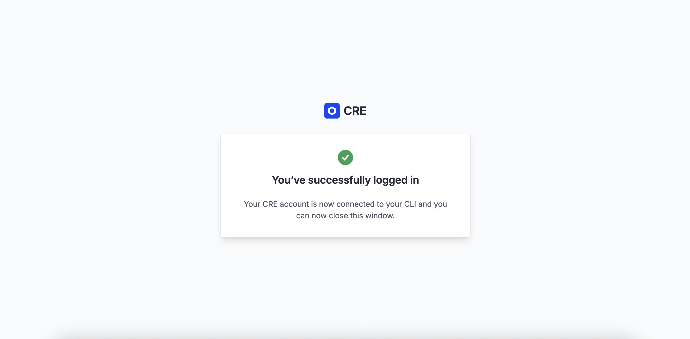

# Sprint de Configuración del CRE CLI

Antes de comenzar a desarrollar, asegurémonos de que tu entorno CRE esté configurado correctamente. 

Seguiremos las instrucciones oficiales de configuración de [cre.chain.link](https://cre.chain.link).

## Paso 1: Crear una Cuenta CRE

1. Ve a [cre.chain.link](https://cre.chain.link)
2. Crea una cuenta o inicia sesión
3. Accede al panel de la plataforma CRE


## Paso 2: Instalar el CRE CLI

El **CRE CLI** es esencial para compilar y simular workflows. Compila tu código TypeScript en binarios WebAssembly (WASM) y te permite probar workflows localmente antes del despliegue.

### Opción 1: Instalación Automática

La forma más fácil de instalar el CRE CLI es usando el script de instalación ([documentación de referencia](https://docs.chain.link/cre/getting-started/cli-installation)):

#### macOS/Linux

```bash
curl -sSL https://cre.chain.link/install.sh | sh
```

#### Windows

```powershell
irm https://cre.chain.link/install.ps1 | iex
```

### Opción 2: Instalación Manual

Si prefieres instalar manualmente o la instalación automática no funciona en tu entorno, sigue las instrucciones de instalación de la Documentación Oficial de Chainlink para tu plataforma:

- [macOS/Linux](https://docs.chain.link/cre/getting-started/cli-installation/macos-linux#manual-installation)
- [Windows](https://docs.chain.link/cre/getting-started/cli-installation/windows#manual-installation)

### Verificar la Instalación

```bash
cre version
```

## Paso 3: Iniciar sesión con CRE CLI

Inicia sesión con CRE CLI:

```bash
cre login
```

Esto abrirá una ventana del navegador para que te autentiques. Una vez autenticado, CRE CLI estará listo para usar.



Verifica tu estado de sesión y los detalles de tu cuenta con:

```bash
cre whoami
```

## Solución de Problemas

### CRE CLI No Encontrado

Si el comando `cre` no se encuentra después de la instalación:

```bash
# Agregar a tu perfil de shell (~/.bashrc, ~/.zshrc, etc.)
export PATH="$HOME/.cre/bin:$PATH"

# Recargar tu shell
source ~/.zshrc  # o ~/.bashrc
```

## ¿Qué Es Posible Ahora?

Ahora que tu entorno CRE está configurado, puedes:

- **Crear nuevos proyectos CRE**: Comienza ejecutando el comando `cre init`
- **Compilar workflows**: El CRE CLI compila tu código TypeScript en binarios WASM
- **Simular workflows**: Prueba tus workflows localmente con `cre workflow simulate`
- **Desplegar workflows**: Una vez listo, despliega en producción (Early Access)
