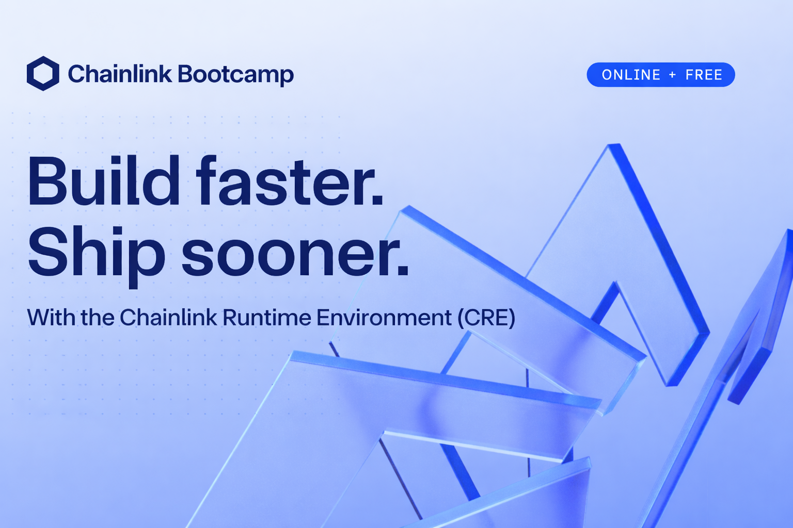

# Bem-vindo ao CRE Bootcamp

Bem-vindo ao **CRE Bootcamp: Construindo Mercados de Previsão com IA**!

Este é um bootcamp prático de 3 dias, projetado para oferecer um passo a passo detalhado e focado em desenvolvedores sobre como construir com o Chainlink Runtime Environment (CRE).

## 🎤 Conheça Seus Instrutores

### Andrej Rakic
**Engenheiro de DevRel, Chainlink Labs**

X (Twitter): [@andrej_dev](https://x.com/andrej_dev)

LinkedIn: [Andrej Rakic](https://www.linkedin.com/in/andrejrakic/)

### Solange Gueiros
**Gerente de Educação DevRel, Chainlink Labs**

X (Twitter): [@solangegueiros](https://twitter.com/solangegueiros)

LinkedIn: [Solange Gueiros](https://www.linkedin.com/in/solangegueiros/)

## Programação

### 📅 Dia 1: Pré-requisitos, Fundamentos e Mentalidade de Negócios CRE

- Conceitos de mercados de previsão e demonstração
- Checklist de requisitos e resolução de problemas de instalação
- Modelo Mental do CRE
- Inicialização, Estrutura e Primeira Simulação de Projeto CRE
- Scaffold CRE
- ❓ Perguntas e Respostas - Espaço aberto para perguntas

### 📅 Dia 2: Smart Contract e Criação de Mercados

Construa seu primeiro workflow CRE que cria mercados de previsão on-chain:
- Configuração do Projeto
- Deploy do Smart Contract
- HTTP Trigger
- Capability EVM Write
- ❓ Perguntas e Respostas - Espaço aberto para perguntas

### 📅 Dia 3: Fluxo Completo de Liquidação

Conecte um sistema completo de liquidação com IA:
- Log Trigger para Fluxos Orientados a Eventos
- Capability EVM Read
- HTTP Capability
- Integração com IA usando Google Gemini
- Fluxo de Liquidação Ponta a Ponta
- ❓ Perguntas e Respostas - Espaço aberto para perguntas

